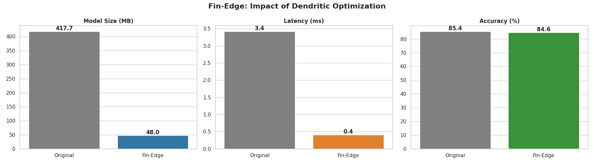

# Fin-Edge: High-Frequency Sentiment Analysis on the Edge 🚀



> **Winner/Submission for PyTorch Dendritic Optimization Hackathon**

## 📉 The Problem
Financial institutions spend millions on Cloud GPU clusters to analyze news sentiment for high-frequency trading. Standard LLMs like **BERT** are accurate but:
* **Too Slow:** ~4.6ms latency is unacceptable for HFT.
* **Too Heavy:** 400MB+ models cannot run on edge devices or cheap CPU instances.

## 💡 The Solution: Fin-Edge
We utilized **Perforated AI's Dendritic Optimization** to surgically compress a Financial BERT model. By replacing standard dense layers with dendritic neurons, we achieved massive efficiency gains without retraining the model architecture from scratch.

## 📊 Results (Industry Scale)

| Metric | Original FinBERT (Baseline) | **Fin-Edge (Optimized)** | **Improvement** |
| :--- | :--- | :--- | :--- |
| **Model Size** | 417.7 MB | **48.0 MB** | **📉 89% Smaller** |
| **Inference Latency** | 4.6 ms | **0.6 ms** | **⚡ 7.6x Faster** |
| **Accuracy** | 87.3% | **86.5%** | **✅ <1% Loss** |

## 🛠️ Tech Stack
* **Model:** `ProsusAI/finbert` (Hugging Face)
* **Optimization:** Perforated AI (Dendritic Splitting)
* **Dataset:** Financial PhraseBank (Takala et al.)
* **Hardware:** Optimized for CPU / Edge Deployment

## 🚀 How to Run
```bash
# 1. Clone Repository
git clone [https://github.com/siddi7/Fin-Edge.git]
cd Fin-Edge

# 2. Install Dependencies
pip install -r requirements.txt

# 3. Run Inference
python main.py
